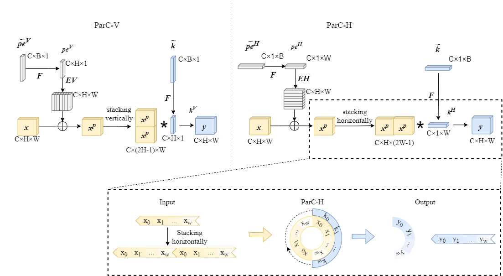
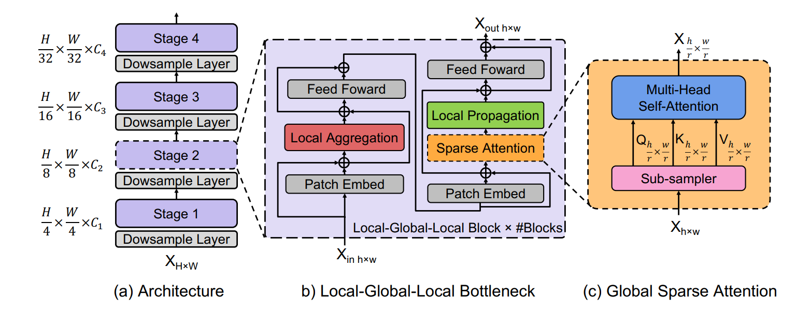

# Efficient Vision Transformer
A curated list of visual attention modules, Flops is calculated under 64x224x224 resolution.

## Table of Contents

* **[Papeprs](#papeprs)**
* **[Channel Domain](#channel-domain)**
* **[Spatial Domain](#spatial-domain)**
* **[Mix Domain](#mix-domain)**
* **[Lightweight Transformer Operater](#transformer)**

## Papers
### Efficient Vision Transformer
* **DeiT**: "Training data-efficient image transformers & distillation through attention", ICML, 2021 (*Facebook*). [[Paper](https://arxiv.org/abs/2012.12877)][[PyTorch](https://github.com/facebookresearch/deit)]
* **ConViT**: "ConViT: Improving Vision Transformers with Soft Convolutional Inductive Biases", ICML, 2021 (*Facebook*). [[Paper](https://arxiv.org/abs/2103.10697)][[Code](https://github.com/facebookresearch/convit)]
* **?**: "Improving the Efficiency of Transformers for Resource-Constrained Devices", DSD, 2021 (*NavInfo Europe, Netherlands*). [[Paper](https://arxiv.org/abs/2106.16006)]
* **PS-ViT**: "Vision Transformer with Progressive Sampling", ICCV, 2021 (*CPII*). [[Paper](https://arxiv.org/abs/2108.01684)]
* **HVT**: "Scalable Visual Transformers with Hierarchical Pooling", ICCV, 2021 (*Monash University*). [[Paper](https://arxiv.org/abs/2103.10619)][[PyTorch](https://github.com/MonashAI/HVT)]
* **CrossViT**: "CrossViT: Cross-Attention Multi-Scale Vision Transformer for Image Classification", ICCV, 2021 (*MIT-IBM*). [[Paper](https://arxiv.org/abs/2103.14899)][[PyTorch](https://github.com/IBM/CrossViT)]
* **ViL**: "Multi-Scale Vision Longformer: A New Vision Transformer for High-Resolution Image Encoding", ICCV, 2021 (*Microsoft*). [[Paper](https://arxiv.org/abs/2103.15358)][[PyTorch](https://github.com/microsoft/vision-longformer)]
* **Visformer**: "Visformer: The Vision-friendly Transformer", ICCV, 2021 (*Beihang University*). [[Paper](https://arxiv.org/abs/2104.12533)][[PyTorch](https://github.com/danczs/Visformer)]
* **MultiExitViT**: "Multi-Exit Vision Transformer for Dynamic Inference", BMVC, 2021 (*Aarhus University, Denmark*). [[Paper](https://arxiv.org/abs/2106.15183)][[Tensorflow](https://gitlab.au.dk/maleci/multiexitvit)]
* **SViTE**: "Chasing Sparsity in Vision Transformers: An End-to-End Exploration", NeurIPS, 2021 (*UT Austin*). [[Paper](https://arxiv.org/abs/2106.04533)][[PyTorch](https://github.com/VITA-Group/SViTE)]
* **DGE**: "Dynamic Grained Encoder for Vision Transformers", NeurIPS, 2021 (*Megvii*). [[Paper](https://papers.nips.cc/paper/2021/hash/2d969e2cee8cfa07ce7ca0bb13c7a36d-Abstract.html)][[PyTorch](https://github.com/StevenGrove/vtpack)]
* **GG-Transformer**: "Glance-and-Gaze Vision Transformer", NeurIPS, 2021 (*JHU*). [[Paper](https://arxiv.org/abs/2106.02277)][[Code (in construction)](https://github.com/yucornetto/GG-Transformer)]
* **DynamicViT**: "DynamicViT: Efficient Vision Transformers with Dynamic Token Sparsification", NeurIPS, 2021 (*Tsinghua*). [[Paper](https://arxiv.org/abs/2106.02034)][[PyTorch](https://github.com/raoyongming/DynamicViT)][[Website](https://dynamicvit.ivg-research.xyz/)]
* **ResT**: "ResT: An Efficient Transformer for Visual Recognition", NeurIPS, 2021 (*Nanjing University*). [[Paper](https://arxiv.org/abs/2105.13677)][[PyTorch](https://github.com/wofmanaf/ResT)]
* **Adder-Transformer**: "Adder Attention for Vision Transformer", NeurIPS, 2021 (*Huawei*). [[Paper](https://proceedings.neurips.cc/paper/2021/hash/a57e8915461b83adefb011530b711704-Abstract.html)]
* **SOFT**: "SOFT: Softmax-free Transformer with Linear Complexity", NeurIPS, 2021 (*Fudan*). [[Paper](https://arxiv.org/abs/2110.11945)][[PyTorch](https://github.com/fudan-zvg/SOFT)][[Website](https://fudan-zvg.github.io/SOFT/)]
* **IA-RED2**: "IA-RED2: Interpretability-Aware Redundancy Reduction for Vision Transformers", NeurIPS, 2021 (*MIT-IBM*). [[Paper](https://arxiv.org/abs/2106.12620)][[Website](http://people.csail.mit.edu/bpan/ia-red/)]
* **LocalViT**: "LocalViT: Bringing Locality to Vision Transformers", arXiv, 2021 (*ETHZ*). [[Paper](https://arxiv.org/abs/2104.05707)][[PyTorch](https://github.com/ofsoundof/LocalViT)]
* **CCT**: "Escaping the Big Data Paradigm with Compact Transformers", arXiv, 2021 (*University of Oregon*). [[Paper](https://arxiv.org/abs/2104.05704)][[PyTorch](https://github.com/SHI-Labs/Compact-Transformers)]
* **DiversePatch**: "Vision Transformers with Patch Diversification", arXiv, 2021 (*UT Austin + Facebook*). [[Paper](https://arxiv.org/abs/2104.12753)][[PyTorch](https://github.com/ChengyueGongR/PatchVisionTransformer)] 
* **SL-ViT**: "Single-Layer Vision Transformers for More Accurate Early Exits with Less Overhead", arXiv, 2021 (*Aarhus University*). [[Paper](https://arxiv.org/abs/2105.09121)]
* **?**: "Multi-Exit Vision Transformer for Dynamic Inference", arXiv, 2021 (*Aarhus University, Denmark*). [[Paper](https://arxiv.org/abs/2106.15183)]
* **ViX**: "Vision Xformers: Efficient Attention for Image Classification", arXiv, 2021 (*Indian Institute of Technology Bombay*). [[Paper](https://arxiv.org/abs/2107.02239)]
* **Transformer-LS**: "Long-Short Transformer: Efficient Transformers for Language and Vision", NeurIPS, 2021 (*NVIDIA*). [[Paper](https://arxiv.org/abs/2107.02192)][[PyTorch](https://github.com/NVIDIA/transformer-ls)]
* **WideNet**: "Go Wider Instead of Deeper", arXiv, 2021 (*NUS*). [[Paper](https://arxiv.org/abs/2107.11817)]
* **Armour**: "Armour: Generalizable Compact Self-Attention for Vision Transformers", arXiv, 2021 (*Arm*). [[Paper](https://arxiv.org/abs/2108.01778)]
* **IPE**: "Exploring and Improving Mobile Level Vision Transformers", arXiv, 2021 (*CUHK*). [[Paper](https://arxiv.org/abs/2108.13015)]
* **DS-Net++**: "DS-Net++: Dynamic Weight Slicing for Efficient Inference in CNNs and Transformers", arXiv, 2021 (*Monash University*). [[Paper](https://arxiv.org/abs/2109.10060)][[PyTorch](https://github.com/changlin31/DS-Net)]
* **UFO-ViT**: "UFO-ViT: High Performance Linear Vision Transformer without Softmax", arXiv, 2021 (*Kakao*). [[Paper](https://arxiv.org/abs/2109.14382)]
* **Token-Pooling**: "Token Pooling in Visual Transformers", arXiv, 2021 (*Apple*). [[Paper](https://arxiv.org/abs/2110.03860)]
* **Evo-ViT**: "Evo-ViT: Slow-Fast Token Evolution for Dynamic Vision Transformer", AAAI, 2022 (*Tencent*). [[Paper](https://arxiv.org/abs/2108.01390)][[PyTorch](https://github.com/YifanXu74/Evo-ViT)]
* **PS-Attention**: "Pale Transformer: A General Vision Transformer Backbone with Pale-Shaped Attention", AAAI, 2022 (*Baidu*). [[Paper](https://arxiv.org/abs/2112.14000)][[Paddle](https://github.com/BR-IDL/PaddleViT)]
* **ShiftViT**: "When Shift Operation Meets Vision Transformer: An Extremely Simple Alternative to Attention Mechanism", AAAI, 2022 (*Microsoft*). [[Paper](https://arxiv.org/abs/2201.10801)][[PyTorch](https://github.com/microsoft/SPACH)]
* **EViT**: "Not All Patches are What You Need: Expediting Vision Transformers via Token Reorganizations", ICLR, 2022 (*Tencent*). [[Paper](https://arxiv.org/abs/2202.07800)][[PyTorch](https://github.com/youweiliang/evit)]
* **QuadTree**: "QuadTree Attention for Vision Transformers", ICLR, 2022 (*Simon Fraser + Alibaba*). [[Paper](https://arxiv.org/abs/2201.02767)][[PyTorch](https://github.com/Tangshitao/QuadtreeAttention)]
* **Anti-Oversmoothing**: "Anti-Oversmoothing in Deep Vision Transformers via the Fourier Domain Analysis: From Theory to Practice", ICLR, 2022 (*UT Austin*). [[Paper](https://arxiv.org/abs/2203.05962)][[PyTorch](https://github.com/VITA-Group/ViT-Anti-Oversmoothing)]
* **QnA**: "Learned Queries for Efficient Local Attention", CVPR, 2022 (*Tel-Aviv*). [[Paper](https://arxiv.org/abs/2112.11435)][[Jax](https://github.com/moabarar/qna)]
* **LVT**: "Lite Vision Transformer with Enhanced Self-Attention", CVPR, 2022 (*Adobe*). [[Paper](https://arxiv.org/abs/2112.10809)][[PyTorch](https://github.com/Chenglin-Yang/LVT)]
* **A-ViT**: "A-ViT: Adaptive Tokens for Efficient Vision Transformer", CVPR, 2022 (*NVIDIA*). [[Paper](https://arxiv.org/abs/2112.07658)][[Website](https://a-vit.github.io/)]
* **PS-ViT**: "Patch Slimming for Efficient Vision Transformers", CVPR, 2022 (*Huawei*). [[Paper](https://arxiv.org/abs/2106.02852)]
* **Rev-MViT**: "Reversible Vision Transformers", CVPR, 2022 (*Meta*). [[Paper](https://arxiv.org/abs/2302.04869)][[PyTorch-1](https://github.com/karttikeya/minREV)][[PyTorch-2](https://github.com/facebookresearch/slowfast)]
* **AdaViT**: "AdaViT: Adaptive Vision Transformers for Efficient Image Recognition", CVPR, 2022 (*Fudan*). [[Paper](https://arxiv.org/abs/2111.15668)]
* **DQS**: "Dynamic Query Selection for Fast Visual Perceiver", CVPRW, 2022 (*Sorbonne Universite', France*). [[Paper](https://arxiv.org/abs/2205.10873)]
* **ATS**: "Adaptive Token Sampling For Efficient Vision Transformers", ECCV, 2022 (*Microsoft*). [[Paper](https://arxiv.org/abs/2111.15667)][[Website](https://adaptivetokensampling.github.io/)]
* **EdgeViT**: "EdgeViTs: Competing Light-weight CNNs on Mobile Devices with Vision Transformers", ECCV, 2022 (*Samsung*). [[Paper](https://arxiv.org/abs/2205.03436)][[PyTorch](https://github.com/saic-fi/edgevit)]
* **SReT**: "Sliced Recursive Transformer", ECCV, 2022 (*CMU + MBZUAI*). [[Paper](https://arxiv.org/abs/2111.05297)][[PyTorch](https://github.com/szq0214/SReT)]
* **SiT**: "Self-slimmed Vision Transformer", ECCV, 2022 (*SenseTime*). [[Paper](https://arxiv.org/abs/2111.12624)][[PyTorch](https://github.com/Sense-X/SiT)]
* **DFvT**: "Doubly-Fused ViT: Fuse Information from Vision Transformer Doubly with Local Representation", ECCV, 2022 (*Alibaba*). [[Paper](https://www.ecva.net/papers/eccv_2022/papers_ECCV/html/322_ECCV_2022_paper.php)]
* **M3ViT**: "M3ViT: Mixture-of-Experts Vision Transformer for Efficient Multi-task Learning with Model-Accelerator Co-design", NeurIPS, 2022 (*UT Austin*). [[Paper](https://arxiv.org/abs/2210.14793)][[PyTorch](https://github.com/VITA-Group/M3ViT)]
* **ResT-V2**: "ResT V2: Simpler, Faster and Stronger", NeurIPS, 2022 (*Nanjing University*). [[Paper](https://arxiv.org/abs/2204.07366)][[PyTorch](https://github.com/wofmanaf/ResT)]
* **DeiT-Manifold**: "Learning Efficient Vision Transformers via Fine-Grained Manifold Distillation", NeurIPS, 2022 (*Huawei*). [[Paper](https://arxiv.org/abs/2107.01378)]
* **EfficientFormer**: "EfficientFormer: Vision Transformers at MobileNet Speed", NeurIPS, 2022 (*Snap*). [[Paper](https://arxiv.org/abs/2206.01191)][[PyTorch](https://github.com/snap-research/EfficientFormer)]
* **GhostNetV2**: "GhostNetV2: Enhance Cheap Operation with Long-Range Attention", NeurIPS, 2022 (*Huawei*). [[Paper](https://arxiv.org/abs/2211.12905)][[PyTorch](https://github.com/huawei-noah/Efficient-AI-Backbones/tree/master/ghostnetv2_pytorch)]
* **?**: "Training a Vision Transformer from scratch in less than 24 hours with 1 GPU", NeurIPSW, 2022 (*Borealis AI, Canada*). [[Paper](https://arxiv.org/abs/2211.05187)]
* **TerViT**: "TerViT: An Efficient Ternary Vision Transformer", arXiv, 2022 (*Beihang University*). [[Paper](https://arxiv.org/abs/2201.08050)]
* **MT-ViT**: "Multi-Tailed Vision Transformer for Efficient Inference", arXiv, 2022 (*Wuhan University*). [[Paper](https://arxiv.org/abs/2203.01587)]
* **ViT-P**: "ViT-P: Rethinking Data-efficient Vision Transformers from Locality", arXiv, 2022 (*Chongqing University of Technology*). [[Paper](https://arxiv.org/abs/2203.02358)]
* **CF-ViT**: "Coarse-to-Fine Vision Transformer", arXiv, 2022 (*Xiamen University + Tencent*). [[Paper](https://arxiv.org/abs/2203.03821)][[PyTorch](https://github.com/ChenMnZ/CF-ViT)]
* **EIT**: "EIT: Efficiently Lead Inductive Biases to ViT", arXiv, 2022 (*Academy of Military Sciences, China*). [[Paper](https://arxiv.org/abs/2203.07116)]
* **SepViT**: "SepViT: Separable Vision Transformer", arXiv, 2022 (*University of Electronic Science and Technology of China*). [[Paper](https://arxiv.org/abs/2203.15380)]
* **TRT-ViT**: "TRT-ViT: TensorRT-oriented Vision Transformer", arXiv, 2022 (*ByteDance*). [[Paper](https://arxiv.org/abs/2205.09579)]
* **SuperViT**: "Super Vision Transformer", arXiv, 2022 (*Xiamen University*). [[Paper](https://arxiv.org/abs/2205.11397)][[PyTorch](https://github.com/lmbxmu/SuperViT)]
* **EfficientViT**: "EfficientViT: Enhanced Linear Attention for High-Resolution Low-Computation Visual Recognition", arXiv, 2022 (*MIT*). [[Paper](https://arxiv.org/abs/2205.14756)]
* **Tutel**: "Tutel: Adaptive Mixture-of-Experts at Scale", arXiv, 2022 (*Microsoft*). [[Paper](https://arxiv.org/abs/2206.03382)][[PyTorch](https://github.com/microsoft/tutel)]
* **SimA**: "SimA: Simple Softmax-free Attention for Vision Transformers", arXiv, 2022 (*Maryland + UC Davis*). [[Paper](https://arxiv.org/abs/2206.08898)][[PyTorch](https://github.com/UCDvision/sima)]
* **EdgeNeXt**: "EdgeNeXt: Efficiently Amalgamated CNN-Transformer Architecture for Mobile Vision Applications", arXiv, 2022 (*MBZUAI*). [[Paper](https://arxiv.org/abs/2206.10589)][[PyTorch](https://github.com/mmaaz60/EdgeNeXt)]
* **VVT**: "Vicinity Vision Transformer", arXiv, 2022 (*Australian National University*). [[Paper](https://arxiv.org/abs/2206.10552)][[Code (in construction)](https://github.com/OpenNLPLab/Vicinity-Vision-Transformer)]
* **SOFT**: "Softmax-free Linear Transformers", arXiv, 2022 (*Fudan*). [[Paper](https://arxiv.org/abs/2207.03341)][[PyTorch](https://github.com/fudan-zvg/SOFT)]
* **MaiT**: "MaiT: Leverage Attention Masks for More Efficient Image Transformers", arXiv, 2022 (*Samsung*). [[Paper](https://arxiv.org/abs/2207.03006)]
* **LightViT**: "LightViT: Towards Light-Weight Convolution-Free Vision Transformers", arXiv, 2022 (*SenseTime*). [[Paper](https://arxiv.org/abs/2207.05557)][[Code (in construction)](https://github.com/hunto/LightViT)]
* **Next-ViT**: "Next-ViT: Next Generation Vision Transformer for Efficient Deployment in Realistic Industrial Scenarios", arXiv, 2022 (*ByteDance*). [[Paper](https://arxiv.org/abs/2207.05501)]
* **XFormer**: "Lightweight Vision Transformer with Cross Feature Attention", arXiv, 2022 (*Samsung*). [[Paper](https://arxiv.org/pdf/2207.07268.pdf)]
* **PatchDropout**: "PatchDropout: Economizing Vision Transformers Using Patch Dropout", arXiv, 2022 (*KTH, Sweden*). [[Paper](https://arxiv.org/abs/2208.07220)]
* **ClusTR**: "ClusTR: Exploring Efficient Self-attention via Clustering for Vision Transformers", arXiv, 2022 (*The University of Adelaide, Australia*). [[Paper](https://arxiv.org/abs/2208.13138)]
* **DiNAT**: "Dilated Neighborhood Attention Transformer", arXiv, 2022 (*University of Oregon*). [[Paper](https://arxiv.org/abs/2209.15001)][[PyTorch](https://github.com/SHI-Labs/Neighborhood-Attention-Transformer)]
* **MobileViTv3**: "MobileViTv3: Mobile-Friendly Vision Transformer with Simple and Effective Fusion of Local, Global and Input Features", arXiv, 2022 (*Micron*). [[Paper](https://arxiv.org/abs/2209.15159)][[PyTorch](https://github.com/micronDLA/MobileViTv3)]
* **ViT-LSLA**: "ViT-LSLA: Vision Transformer with Light Self-Limited-Attention", arXiv, 2022 (*Southwest University*). [[Paper](https://arxiv.org/abs/2210.17115)]
* **Castling-ViT**: "Castling-ViT: Compressing Self-Attention via Switching Towards Linear-Angular Attention During Vision Transformer Inference", arXiv, 2022 (*Meta*). [[Paper](https://arxiv.org/abs/2211.10526)]
* **ViT-Ti**: "RGB no more: Minimally-decoded JPEG Vision Transformers", arXiv, 2022 (*UMich*). [[Paper](https://arxiv.org/abs/2211.16421)]
* **Tri-Level**: "Peeling the Onion: Hierarchical Reduction of Data Redundancy for Efficient Vision Transformer Training", AAAI, 2023 (*Northeastern University*). [[Paper](https://arxiv.org/abs/2211.10801)][[Code (in construction)](https://github.com/ZLKong/Tri-Level-ViT)]
* **ViTCoD**: "ViTCoD: Vision Transformer Acceleration via Dedicated Algorithm and Accelerator Co-Design", IEEE International Symposium on High-Performance Computer Architecture (HPCA), 2023 (*Georgia Tech*). [[Paper](https://arxiv.org/abs/2210.09573)]
* **ViTALiTy**: "ViTALiTy: Unifying Low-rank and Sparse Approximation for Vision Transformer Acceleration with a Linear Taylor Attention", IEEE International Symposium on High-Performance Computer Architecture (HPCA), 2023 (*Rice University*). [[Paper](https://arxiv.org/abs/2211.05109)]
* **HeatViT**: "HeatViT: Hardware-Efficient Adaptive Token Pruning for Vision Transformers", IEEE International Symposium on High-Performance Computer Architecture (HPCA), 2023 (*Northeastern University*). [[Paper](https://arxiv.org/abs/2211.08110)]
* **ToMe**: "Token Merging: Your ViT But Faster", ICLR, 2023 (*Meta*). [[Paper](https://arxiv.org/abs/2210.09461)][[PyTorch](https://github.com/facebookresearch/ToMe)]

### Conv + Transformer
* **LeViT**: "LeViT: a Vision Transformer in ConvNet's Clothing for Faster Inference", ICCV, 2021 (*Facebook*). [[Paper](https://arxiv.org/abs/2104.01136)][[PyTorch](https://github.com/facebookresearch/LeViT)]
* **CeiT**: "Incorporating Convolution Designs into Visual Transformers", ICCV, 2021 (*SenseTime*). [[Paper](https://arxiv.org/abs/2103.11816)][[PyTorch (rishikksh20)](https://github.com/rishikksh20/CeiT)]
* **Conformer**: "Conformer: Local Features Coupling Global Representations for Visual Recognition", ICCV, 2021 (*CAS*). [[Paper](https://arxiv.org/abs/2105.03889)][[PyTorch](https://github.com/pengzhiliang/Conformer)]
* **CoaT**: "Co-Scale Conv-Attentional Image Transformers", ICCV, 2021 (*UCSD*). [[Paper](https://arxiv.org/abs/2104.06399)][[PyTorch](https://github.com/mlpc-ucsd/CoaT)]
* **CvT**: "CvT: Introducing Convolutions to Vision Transformers", ICCV, 2021 (*Microsoft*). [[Paper](https://arxiv.org/abs/2103.15808)][[Code](https://github.com/leoxiaobin/CvT)]
* **ViTc**: "Early Convolutions Help Transformers See Better", NeurIPS, 2021 (*Facebook*). [[Paper](https://arxiv.org/abs/2106.14881)]
* **ConTNet**: "ConTNet: Why not use convolution and transformer at the same time?", arXiv, 2021 (*ByteDance*). [[Paper](https://arxiv.org/abs/2104.13497)][[PyTorch](https://github.com/yan-hao-tian/ConTNet)]
* **SPACH**: "A Battle of Network Structures: An Empirical Study of CNN, Transformer, and MLP", arXiv, 2021 (*Microsoft*). [[Paper](https://arxiv.org/abs/2108.13002)]
* **MobileViT**: "MobileViT: Light-weight, General-purpose, and Mobile-friendly Vision Transformer", ICLR, 2022 (*Apple*). [[Paper](https://arxiv.org/abs/2110.02178)][[PyTorch](https://github.com/apple/ml-cvnets)]
* **CMT**: "CMT: Convolutional Neural Networks Meet Vision Transformers", CVPR, 2022 (*Huawei*). [[Paper](https://arxiv.org/abs/2107.06263)]
* **Mobile-Former**: "Mobile-Former: Bridging MobileNet and Transformer", CVPR, 2022 (*Microsoft*). [[Paper](https://arxiv.org/abs/2108.05895)][[PyTorch (in construction)](https://github.com/aaboys/mobileformer)]
* **TinyViT**: "TinyViT: Fast Pretraining Distillation for Small Vision Transformers", ECCV, 2022 (*Microsoft*). [[Paper](https://arxiv.org/abs/2207.10666)][[PyTorch](https://github.com/microsoft/Cream/tree/main/TinyViT)]
* **CETNet**: "Convolutional Embedding Makes Hierarchical Vision Transformer Stronger", ECCV, 2022 (*OPPO*). [[Paper](https://arxiv.org/abs/2207.13317)]
* **ParC-Net**: "ParC-Net: Position Aware Circular Convolution with Merits from ConvNets and Transformer", ECCV, 2022 (*Intellifusion, China*). [[Paper](https://arxiv.org/abs/2203.03952)][[PyTorch](https://github.com/hkzhang91/ParC-Net)]
* **?**: "How to Train Vision Transformer on Small-scale Datasets?", BMVC, 2022 (*MBZUAI*). [[Paper](https://arxiv.org/abs/2210.07240)][[PyTorch](https://github.com/hananshafi/vits-for-small-scale-datasets)]
* **DHVT**: "Bridging the Gap Between Vision Transformers and Convolutional Neural Networks on Small Datasets", NeurIPS, 2022 (*USTC*). [[Paper](https://arxiv.org/abs/2210.05958)][[Code (in construction)](https://github.com/ArieSeirack/DHVT)]
* **iFormer**: "Inception Transformer", NeurIPS, 2022 (*Sea AI Lab*). [[Paper](https://arxiv.org/abs/2205.12956)][[PyTorch](https://github.com/sail-sg/iFormer)]
* **DenseDCT**: "Explicitly Increasing Input Information Density for Vision Transformers on Small Datasets", NeurIPSW, 2022 (*University of Kansas*). [[Paper](https://arxiv.org/abs/2210.14319)]
* **CXV**: "Convolutional Xformers for Vision", arXiv, 2022 (*IIT Bombay*). [[Paper](https://arxiv.org/abs/2201.10271)][[PyTorch](https://github.com/pranavphoenix/CXV)]
* **ConvMixer**: "Patches Are All You Need?", arXiv, 2022 (*CMU*). [[Paper](https://arxiv.org/abs/2201.09792)][[PyTorch](https://github.com/locuslab/convmixer)]
* **MobileViTv2**: "Separable Self-attention for Mobile Vision Transformers", arXiv, 2022 (*Apple*). [[Paper](https://arxiv.org/abs/2206.02680)][[PyTorch](https://github.com/apple/ml-cvnets)]
* **UniFormer**: "UniFormer: Unifying Convolution and Self-attention for Visual Recognition", arXiv, 2022 (*SenseTime*). [[Paper](https://arxiv.org/abs/2201.09450)][[PyTorch](https://github.com/Sense-X/UniFormer)]
* **EdgeFormer**: "EdgeFormer: Improving Light-weight ConvNets by Learning from Vision Transformers", arXiv, 2022 (*?*). [[Paper](https://arxiv.org/abs/2203.03952)]
* **MoCoViT**: "MoCoViT: Mobile Convolutional Vision Transformer", arXiv, 2022 (*ByteDance*). [[Paper](https://arxiv.org/abs/2205.12635)]
* **DynamicViT**: "Dynamic Spatial Sparsification for Efficient Vision Transformers and Convolutional Neural Networks", arXiv, 2022 (*Tsinghua University*). [[Paper](https://arxiv.org/abs/2207.01580)][[PyTorch](https://github.com/raoyongming/DynamicViT)]
* **ConvFormer**: "ConvFormer: Closing the Gap Between CNN and Vision Transformers", arXiv, 2022 (*National University of Defense Technology, China*). [[Paper](https://arxiv.org/abs/2209.07738)]
* **Fast-ParC**: "Fast-ParC: Position Aware Global Kernel for ConvNets and ViTs", arXiv, 2022 (*Intellifusion, China*). [[Paper](https://arxiv.org/abs/2210.04020)]
* **MetaFormer**: "MetaFormer Baselines for Vision", arXiv, 2022 (*Sea AI Lab*). [[Paper](https://arxiv.org/abs/2210.13452)][[PyTorch](https://github.com/sail-sg/metaformer)]
* **STM**: "Demystify Transformers & Convolutions in Modern Image Deep Networks", arXiv, 2022 (*Tsinghua University*). [[Paper](https://arxiv.org/abs/2211.05781)][[Code (in construction)(https://github.com/OpenGVLab/STM-Evaluation)]]
* **InternImage**: "InternImage: Exploring Large-Scale Vision Foundation Models with Deformable Convolutions", arXiv, 2022 (*Shanghai AI Laboratory*). [[Paper](https://arxiv.org/abs/2211.05778)][[Code (in construction)](https://github.com/OpenGVLab/InternImage)]
* **ParCNetV2**: "ParCNetV2: Oversized Kernel with Enhanced Attention", arXiv, 2022 (*Intellifusion, China*). [[Paper](https://arxiv.org/abs/2211.07157)]
* **VAN**: "Visual Attention Network", arXiv, 2022 (*Tsinghua*). [[Paper](https://arxiv.org/abs/2202.09741)][[PyTorch](https://github.com/Visual-Attention-Network)]
* **SD-MAE**: "Masked autoencoders is an effective solution to transformer data-hungry", arXiv, 2022 (*Hangzhou Dianzi University*). [[Paper](https://arxiv.org/abs/2212.05677)][[PyTorch (in construction)](https://github.com/Talented-Q/SDMAE)]
* **SATA**: "Accumulated Trivial Attention Matters in Vision Transformers on Small Datasets", WACV, 2023 (*University of Kansas*). [[Paper](https://arxiv.org/abs/2210.12333)][[PyTorch (in construction)](https://github.com/xiangyu8/SATA)]
* **SparK**: "Sparse and Hierarchical Masked Modeling for Convolutional Representation Learning", ICLR, 2023 (*Bytedance*). [[Paper](https://openreview.net/forum?id=NRxydtWup1S)][[PyTorch](https://github.com/keyu-tian/SparK)]
* **MOAT**: "MOAT: Alternating Mobile Convolution and Attention Brings Strong Vision Models", ICLR, 2023 (*Google*). [[Paper](https://arxiv.org/abs/2210.01820)][[Tensorflow](https://github.com/google-research/deeplab2)]

## Channel Domain
|Paper (year)|Implementation|Key==Query|Flops(G)|Params(M)|
|:---:|:---:|:---:|:---:|:---:|
|[Squeeze-and-Excitation Networks](https://arxiv.org/abs/1709.01507) (2018)|codes/senet.py|:x:|3.21|0.000512|

    

|Paper (year)|Implementation|Key==Query|Flops(G)|Params(M)|
|:---:|:---:|:---:|:---:|:---:|
|[Effective Squeeze-Excitation](https://arxiv.org/abs/1911.06667) (2019)|codes/se.py|:x:|88|88|

    

|Paper (year)|Implementation|Key==Query|Flops(G)|Params(M)|
|:---:|:---:|:---:|:---:|:---:|
|[ECA-Net](https://arxiv.org/pdf/1910.03151.pdf) (2019)|codes/ecanet.py|:x:|3.21|3e-6|

    

|Paper (year)|Implementation|Key==Query|Flops(G)|Params(M)|
|:---:|:---:|:---:|:---:|:---:|
|[SKNet](https://arxiv.org/abs/1903.06586) (2019)|codes/sknet.py|:x:|:x:|:x:|

    

|Paper (year)|Implementation|Key==Query|Flops(G)|Params(M)|
|:---:|:---:|:---:|:---:|:---:|
|[FcaNet](https://arxiv.org/abs/2012.11879) (2020)|codes/fcanet.py|:x:|:x:|:x:|

    

|Paper (year)|Implementation|Key==Query|Flops(G)|Params(M)|
|:---:|:---:|:---:|:---:|:---:|
|[Triplet Attention](https://arxiv.org/abs/2010.03045) (2020)|[Pytorch Codes](https://github.com/LandskapeAI/triplet-attention/blob/master/MODELS/triplet_attention.py)|:x:|7.88|0.0003|

    

## Spatial Domain
|Paper (year)|Implementation|Key==Query|Flops(G)|Params(M)|
|:---:|:---:|:---:|:---:|:---:|
|[Non-local Neural Networks](https://openaccess.thecvf.com/content_cvpr_2018/papers/Wang_Non-Local_Neural_Networks_CVPR_2018_paper.pdf) (2018)|[Pytorch Codes](https://github.com/AlexHex7/Non-local_pytorch)|:heavy_check_mark:|425.49|0.00848|

    

|Paper (year)|Implementation|Key==Query|Flops(G)|Params(M)|
|:---:|:---:|:---:|:---:|:---:|
|[SAGAN](https://arxiv.org/pdf/1805.08318.pdf) (2018)|[codes/sa.py]|:heavy_check_mark:|260.91|0.0052|

    

|Paper (year)|Implementation|Key==Query|Flops(G)|Params(M)|
|:---:|:---:|:---:|:---:|:---:|
|[ISA](https://arxiv.org/pdf/1907.12273v2.pdf) (2019)|[Pytorch Codes](https://github.com/openseg-group/openseg.pytorch/blob/master/lib/models/modules/isa_block.py)|:heavy_check_mark:|:x:|:x:|

    

## Mix Domain
|Paper (year)|Implementation|Key==Query|Flops(G)|Params(M)|
|:---:|:---:|:---:|:---:|:---:|
|[CBAM](https://arxiv.org/abs/1807.06521) (2018)|codes/cbam.py|:x:|5.02|0.00068|

    

|Paper (year)|Implementation|Key==Query|Flops(G)|Params(M)|
|:---:|:---:|:---:|:---:|:---:|
|[AA-Nets](https://arxiv.org/pdf/1810.11579.pdf) (2018)|[Pytorch Codes](https://github.com/nguyenvo09/Double-Attention-Network/blob/master/double_attention_layer.py)|:heavy_check_mark:|:x:|:x:|

    

|Paper (year)|Implementation|Key==Query|Flops(G)|Params(M)|
|:---:|:---:|:---:|:---:|:---:|
|[Split-Attention Networks](https://arxiv.org/pdf/2004.08955.pdf) (2020)|[Pytorch Codes](https://github.com/rwightman/pytorch-image-models/blob/master/timm/models/resnest.py)|:x:|:x:|:x:|

    

## Lightweight Transformer Operater

|Paper (year)|Implementation|Key==Query|Flops(G)|Params(M)|
|:---:|:---:|:---:|:---:|:---:|
|[ParC-Net](https://arxiv.org/abs/2203.03952) (2022)|[Pytorch Codes](https://github.com/hkzhang91/ParC-Net.git)|:x:|:x:|:x:|

|Paper (year)|Implementation|Key==Query|Flops(G)|Params(M)|
|:---:|:---:|:---:|:---:|:---:|
|[EdgeViTs](https://arxiv.org/pdf/2205.03436.pdf) (2022)|[Pytorch Codes](https://github.com/saic-fi/edgevit.git)|:x:|:x:|:x:|

