# awesome-visual-attention 

A curated list of visual attention modules, Flops is calculated under 64x224x224 resolution.

## Table of Contents

* **[Channel Domain](#channel-domain)**
* **[Spatial Domain](#spatial-domain)**
* **[Mix Domain](#mix-domain)**

## Channel Domain
|Paper (year)|Implementation|Key==Query|Flops(G)|Params(M)|
|:---:|:---:|:---:|:---:|:---:|
|[Squeeze-and-Excitation Networks](https://arxiv.org/abs/1709.01507) (2018)|codes/se.py|:heavy_check_mark:|88|88|

    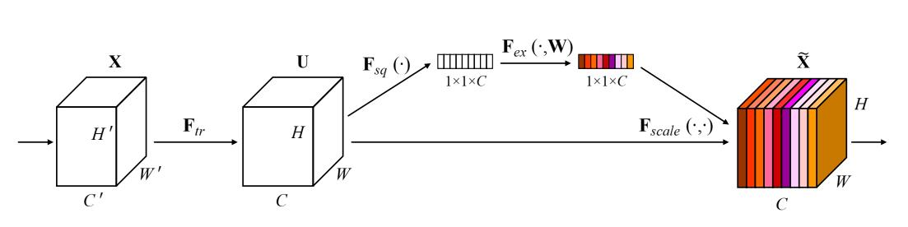

|Paper (year)|Implementation|Key==Query|Flops(G)|Params(M)|
|:---:|:---:|:---:|:---:|:---:|
|[Effective Squeeze-Excitation](https://arxiv.org/abs/1911.06667) (2019)|codes/se.py|:x:|88|88|

    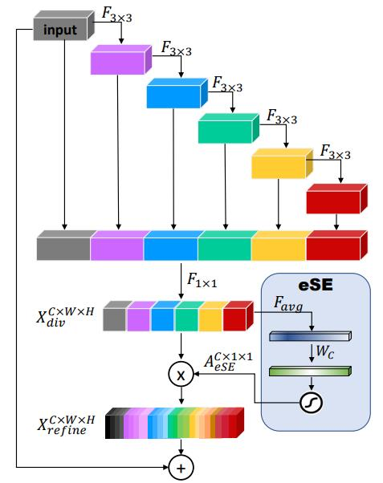

|Paper (year)|Implementation|Key==Query|Flops(G)|Params(M)|
|:---:|:---:|:---:|:---:|:---:|
|[ECA-Net](https://arxiv.org/pdf/1910.03151.pdf) (2019)|codes/se.py|:x:|88|88|

    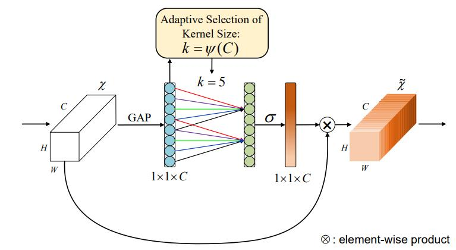

|Paper (year)|Implementation|Key==Query|Flops(G)|Params(M)|
|:---:|:---:|:---:|:---:|:---:|
|[SKNet](https://arxiv.org/abs/1903.06586) (2019)|codes/se.py|:x:|88|88|

    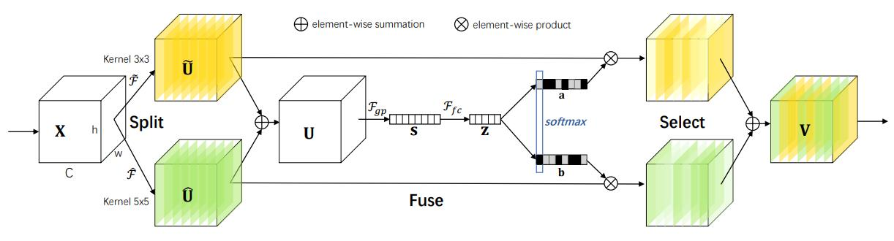

|Paper (year)|Implementation|Key==Query|Flops(G)|Params(M)|
|:---:|:---:|:---:|:---:|:---:|
|[FcaNet](https://arxiv.org/abs/2012.11879) (2020)|codes/se.py|:x:|:x:|:x:|

    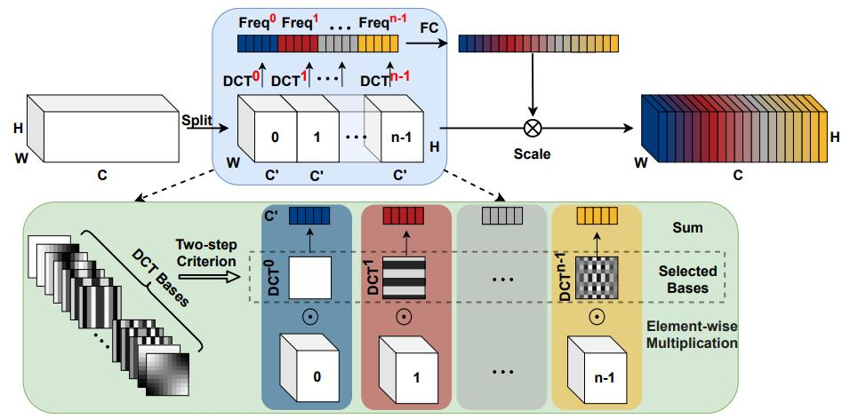

|Paper (year)|Implementation|Key==Query|Flops(G)|Params(M)|
|:---:|:---:|:---:|:---:|:---:|
|[Triplet Attention](https://arxiv.org/abs/2010.03045) (2020)|[Pytorch Codes](https://github.com/LandskapeAI/triplet-attention/blob/master/MODELS/triplet_attention.py)|:x:|:x:|:x:|

    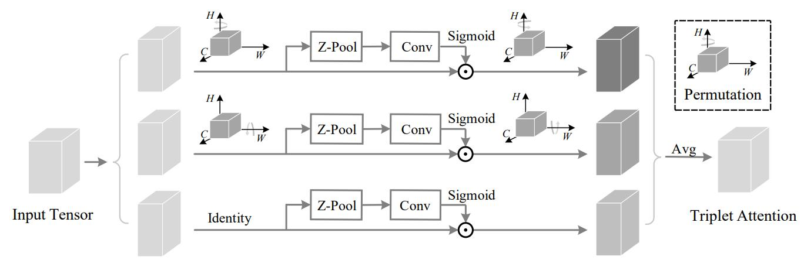

## Spatial Domain
|Paper (year)|Implementation|Key==Query|Flops(G)|Params(M)|
|:---:|:---:|:---:|:---:|:---:|
|[Non-local Neural Networks](https://openaccess.thecvf.com/content_cvpr_2018/papers/Wang_Non-Local_Neural_Networks_CVPR_2018_paper.pdf) (2018)|[Pytorch Codes](https://github.com/AlexHex7/Non-local_pytorch)|:heavy_check_mark:|:x:|:x:|

    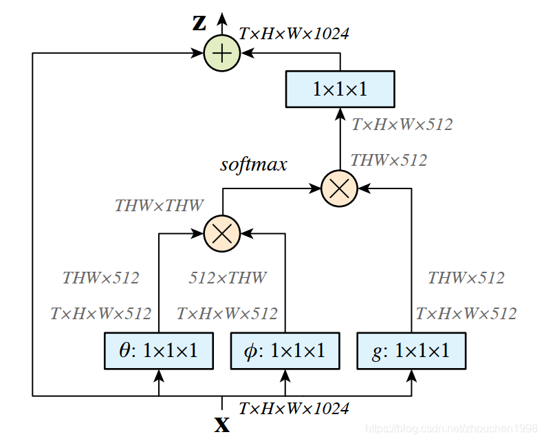

|Paper (year)|Implementation|Key==Query|Flops(G)|Params(M)|
|:---:|:---:|:---:|:---:|:---:|
|[SAGAN](https://arxiv.org/pdf/1805.08318.pdf) (2018)|[codes/se.py]|:heavy_check_mark:|:x:|:x:|

    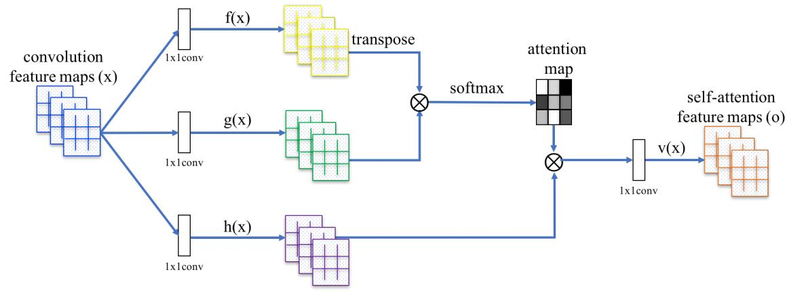

|Paper (year)|Implementation|Key==Query|Flops(G)|Params(M)|
|:---:|:---:|:---:|:---:|:---:|
|[ISA](https://arxiv.org/pdf/1907.12273v2.pdf) (2019)|[Pytorch Codes](https://github.com/openseg-group/openseg.pytorch/blob/master/lib/models/modules/isa_block.py)|:heavy_check_mark:|:x:|:x:|

    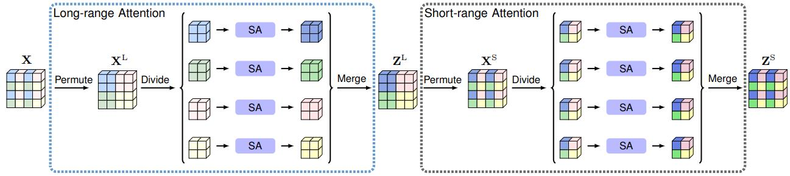

## Mix Domain
|Paper (year)|Implementation|Key==Query|Flops(G)|Params(M)|
|:---:|:---:|:---:|:---:|:---:|
|[CBAM](https://arxiv.org/abs/1807.06521) (2018)|codes/se.py|:heavy_check_mark:|88|88|

    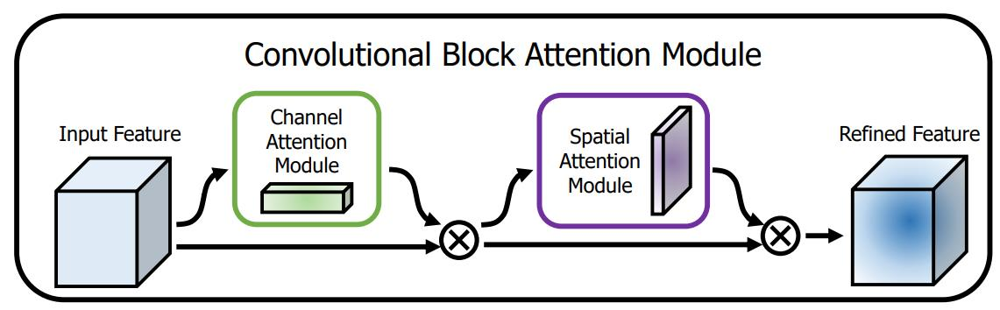

|Paper (year)|Implementation|Key==Query|Flops(G)|Params(M)|
|:---:|:---:|:---:|:---:|:---:|
|[AA-Nets](https://arxiv.org/pdf/1810.11579.pdf) (2018)|[Pytorch Codes](https://github.com/nguyenvo09/Double-Attention-Network/blob/master/double_attention_layer.py)|:heavy_check_mark:|88|88|

    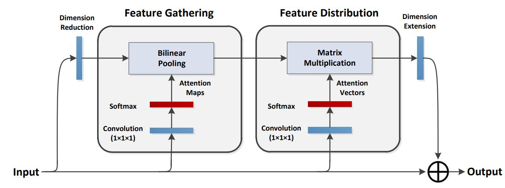

|Paper (year)|Implementation|Key==Query|Flops(G)|Params(M)|
|:---:|:---:|:---:|:---:|:---:|
|[Split-Attention Networks](https://arxiv.org/pdf/2004.08955.pdf) (2020)|[Pytorch Codes](https://github.com/rwightman/pytorch-image-models/blob/master/timm/models/resnest.py)|:x:|:x:|:x:|

    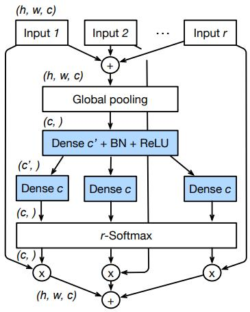

